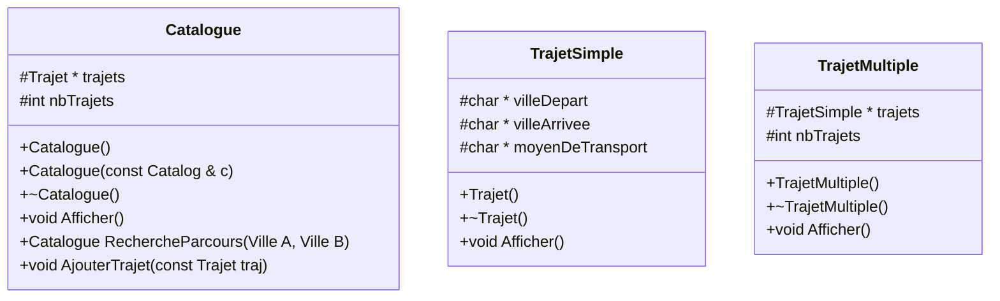
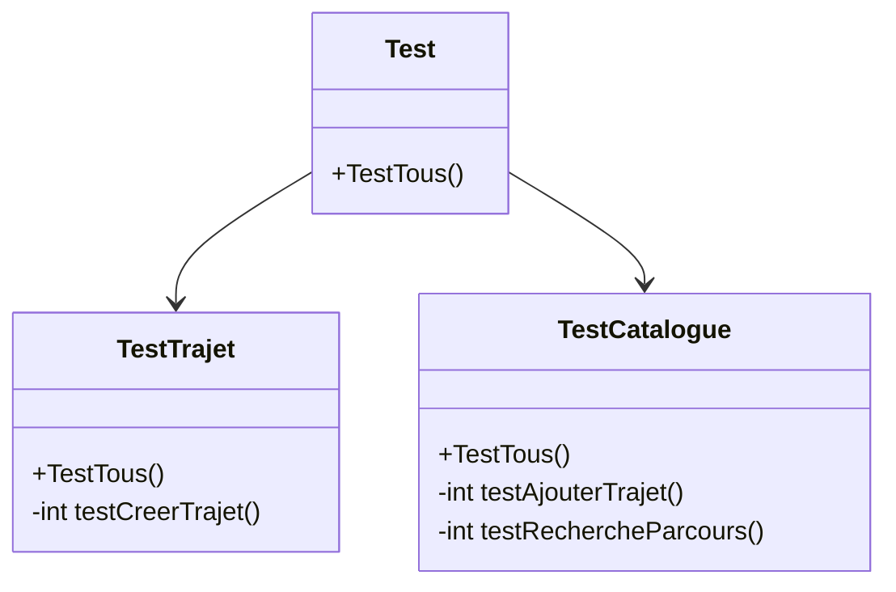
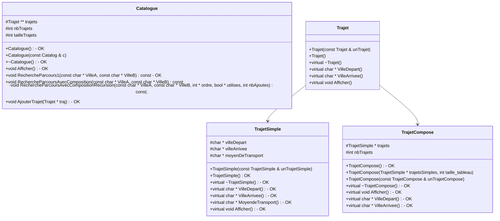

# TP 2 - Programmation en C++ - Bases

## Conception

Premier essai de modules du projet :

et avec des tests qui peuvent au futur ressembler à :

Deuxieme version de modules du projet, qui sera celle utilisée:

## To-do 

- [ ] Corriger l'algo complexe qui doit presque fonctionner
- [ ] Correctement documenter chaque classe et fonction, commenter
Si on a le temps:
- [ ] Rajouter tests TrajetCompose
- [ ] Rajoutertests TrajetSimple
- [ ] Rajoutertests TrajetSimple
- [ ] Checker la mémoire
