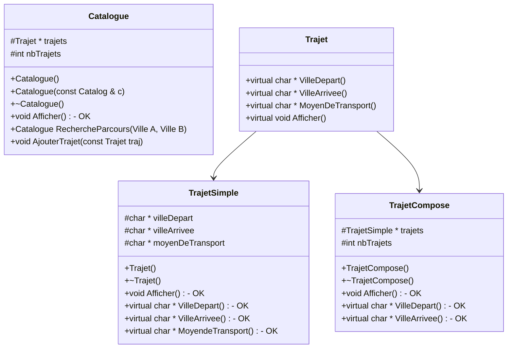

# TP 2 - Programmation en C++ - Bases

## Conception

Premier essai de modules du projet :

et avec des tests qui peuvent au futur ressembler à :

Deuxieme version de modules du projet, qui sera celle utilisée:

