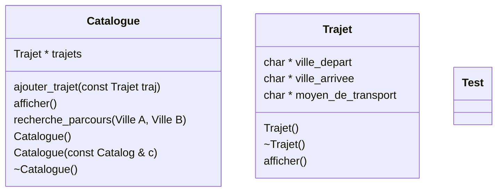

# TP 2 - Programmation en C++ - Bases

## Conception

```mermaid
classDiagram
    class Catalogue {
        Trajet * trajets
        ajouter_trajet(const Trajet traj)
        
        afficher()
        recherche_parcours(Ville A, Ville B)
        Catalogue()
        Catalogue(const Catalog & c)
        ~Catalogue()
    }
    class Trajet {
        char * ville_depart
        char * ville_arrivee
        char * moyen_de_transport
        
        Trajet()
        ~Trajet()
        afficher()
    }
    %% Trajet-->Catalogue
    %%class Ville {
    %%    nom_Ville
    %%    
    %%    Ville()
    %%    Ville(const Ville &v)
    %%    ~Ville()
    %%}
    %% Ville-->Trajet
    %% Ville-->Catalogue

    class Test {

    }

```